# NoPandemic

> https://covaid-14.web.app/

## Table of Contents

- [Introduction](#01)
- [Install](#02)
- [Usage](#03)
- [Taskflow](#04)
- [Features](#05)
- [Preview](#06)
- [Tools](#07)
- [APIs](#08)
- [Resource](#09)
- [Contributor](#10)
- [Change Log](#11)

#

## Introduction

Due the the current COVID19 epidemic, our life are dramatically changed in respect to school, work and everything. There are many information and app online related to COVID-19. However, our team would like to develop an app which not only help user tracks the covid-19 person around the local area, but more acts as an platform which collecting all the information you need to know regarding the current pandemic.

The cluster map data is used for demonstration purpose which we assume we already had government support. After attending some hackthons, we think the process of building a complete and functional system and presenting the idea is more important to us.

#

## Install

> `npm install`

> `yarn install`

#

## Usage

**Please replace the GOOGLE_API_KEY with your google map api token first**

> `npm start`

> `yarn start`

#

## Taskflow

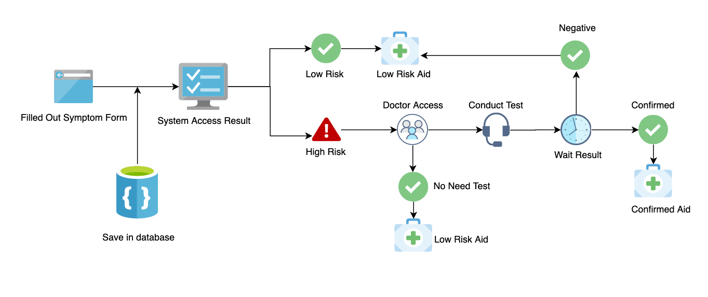

#

## Features

- Display a cluster map which shows number the people who have covid19 symptoms around user's current location
- Swicth prefereed location to easily auto-zoom to that location
- Announcement board shows all the outbreak announcement regarding covid-19
- COVD-19 symptom self accessment and return respected risk level
- Calculating the most frequnt symptom from user input database and displayed as an option for the symptom accessment
- Aid resource package based on user's risk level to covid-19
- Canada government official preventation and isolation strategy packages to help users understand the epidemic
- Official organization which help elder, students and employees who are confirmed as covid-19
- Admin symstem that change user's risk status in order to proceed next step
- Profile and appearance settings with dark mode added
- Donate the people who are in need
- Donate: A dashboard display a list of nurses and doctor
- Display the world map that shows the countries are impacted by the current epidemic (interactive)
- Game: gathers all the covid-19 game that made by BCIT CST students
- Mobile responsive for all devices

#

## Preview

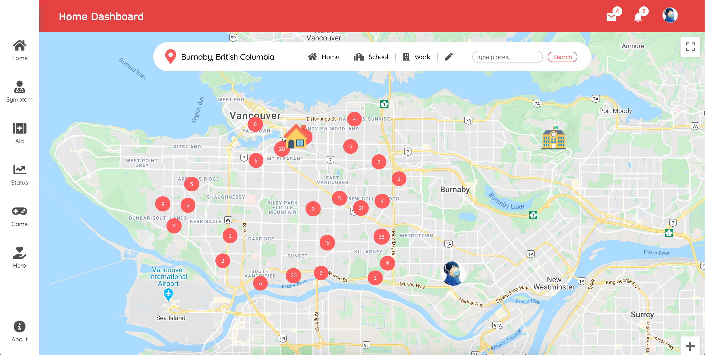
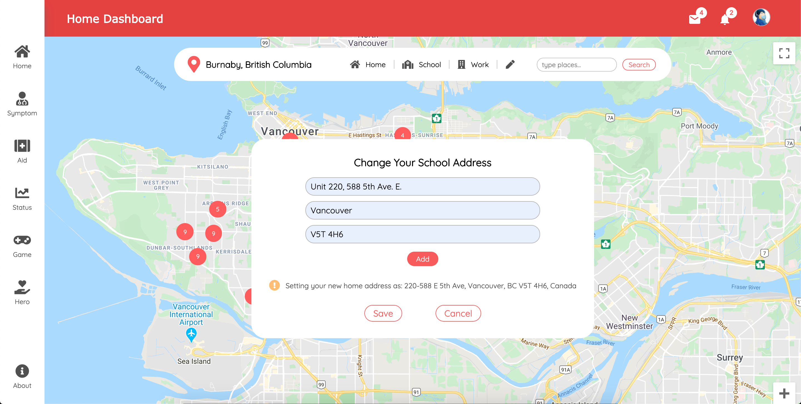
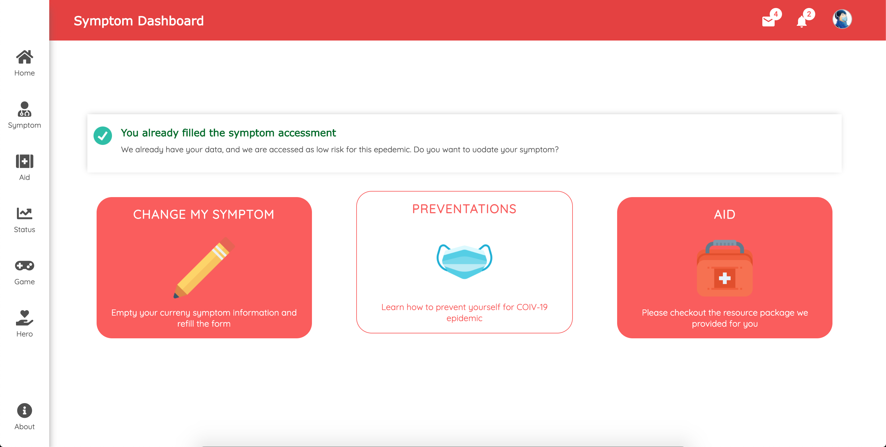
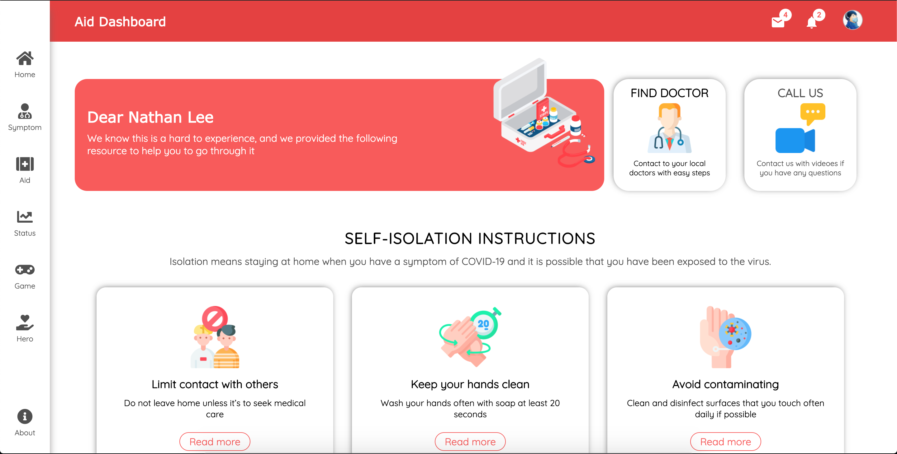
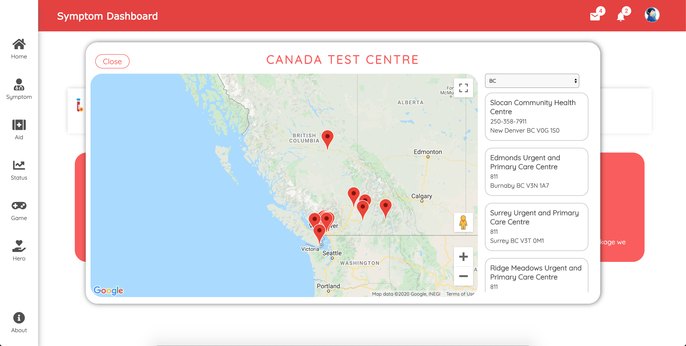
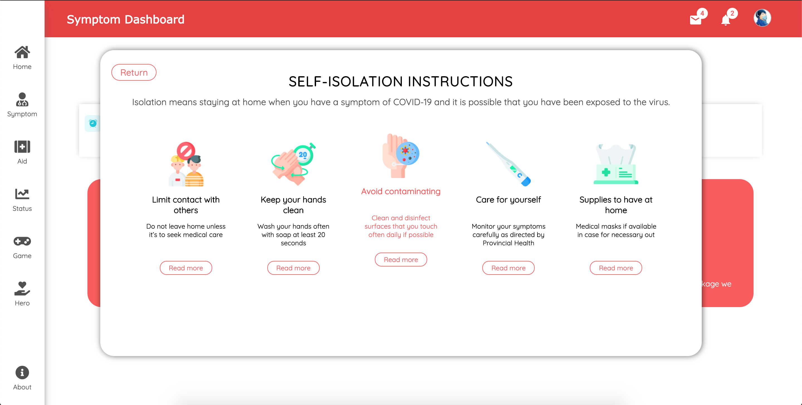
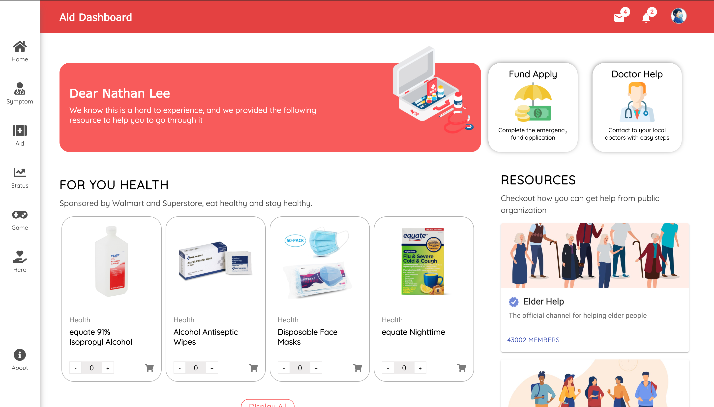
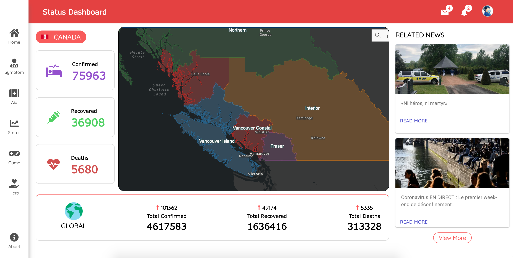

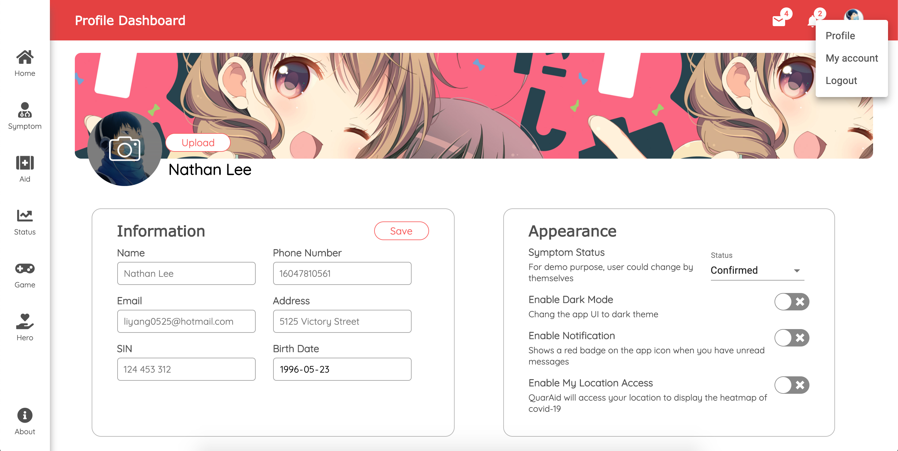

### Dark Mode

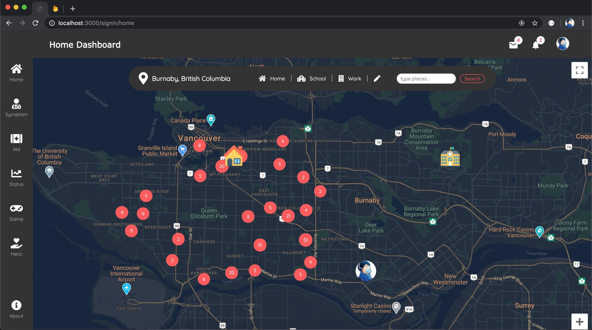
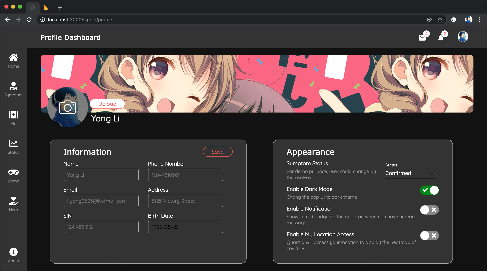
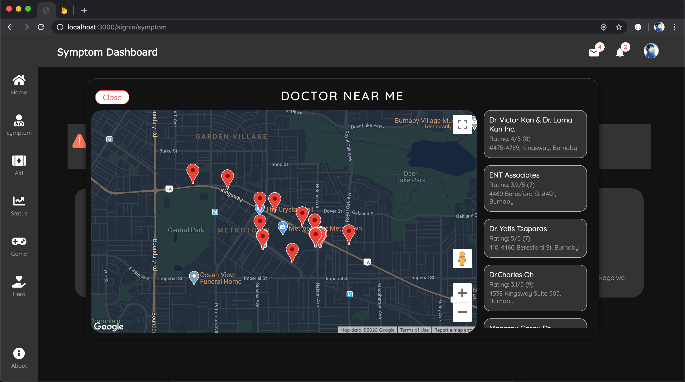
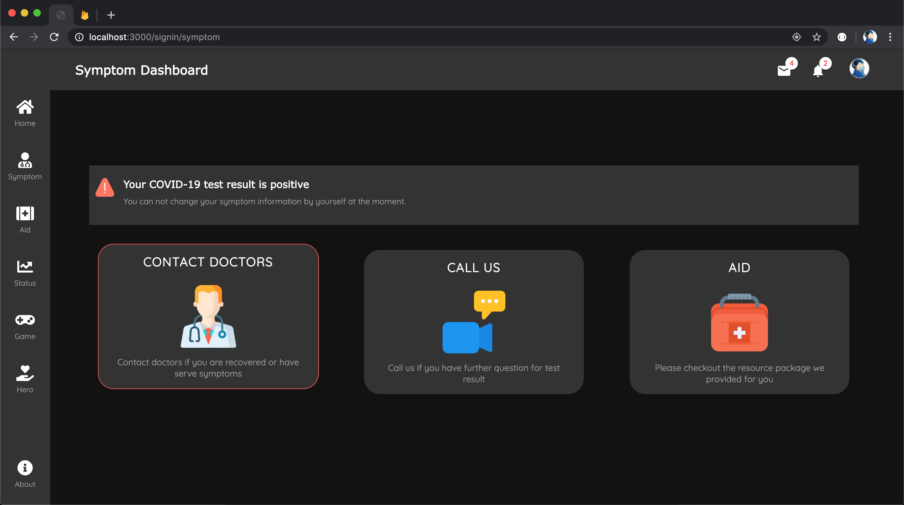
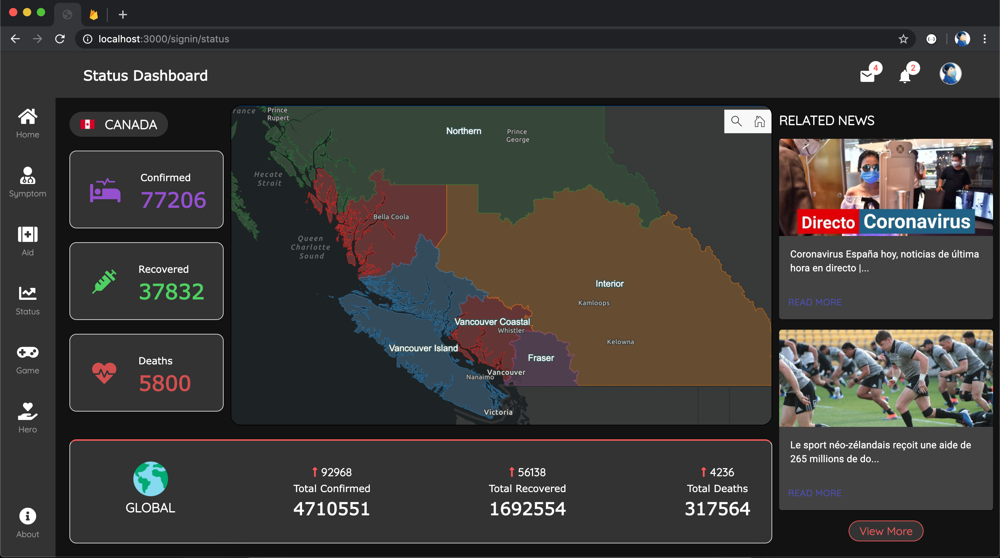
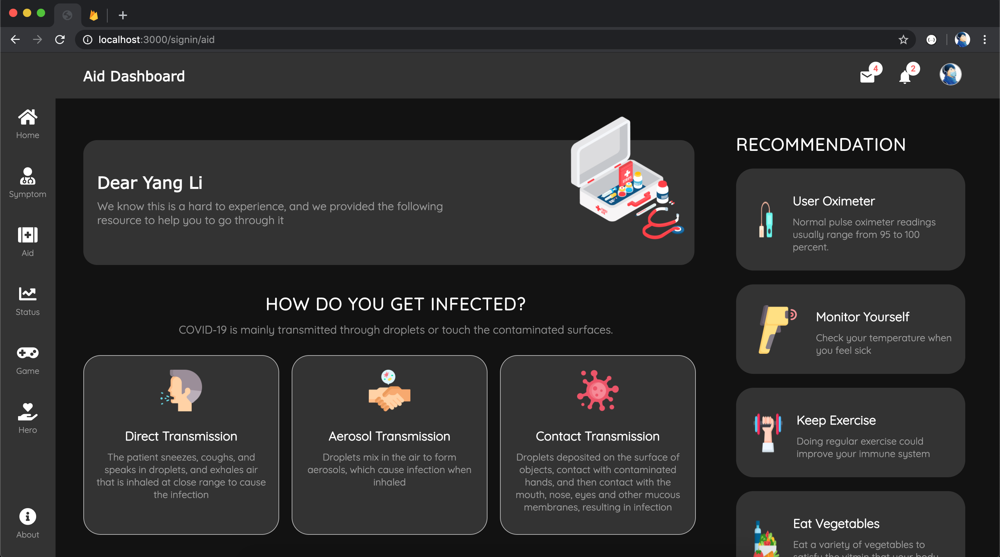

#

## Tools

- HTML5, CSS3
- JavaScript
- React
- Sass
- Firebase
- Python
- PhotoShop, Illustrator

#

## API & Libraries 

- [mathdroid](https://github.com/mathdroid/covid-19-api)
- [COVID19](https://covid19api.com/)
- [News API](https://newsapi.org/)
- [Google Map](https://developers.google.com/maps/documentation)
- [Google Map React](https://github.com/google-map-react/google-map-react)
- [Material UI Framework](https://material-ui.com/)
- [React Grid Gallery](https://github.com/benhowell/react-grid-gallery)
- [jQuery](https://jquery.com/)
- [AOS](https://github.com/michalsnik/aos)

#

## Resources

- [FLATICON](https://www.flaticon.com/home)
- [Freepik](https://www.freepik.com/)

#

## Contributors

    
    

#

## Change Log

### v0.0.3 (2020/05/17 01:48)

- Released dark mode theme for users

### v0.0.2 (2020/05/16 01:48)

- Fixed home loading map bugs
- Added switch panel for home component
- User change symptom status with select drop down list
- Updated 5 different state for symptom return
- Made all component responsive for all devices
- Added hero component
- Added game component

### v0.0.1 (2020/05/11 01:48)

- Initial deploy
